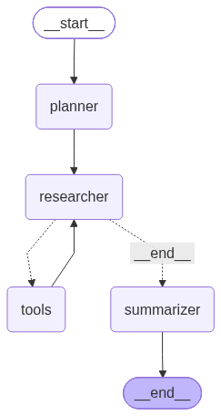
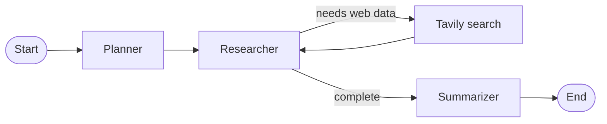

<div align="center">

# AI Researcher


**A terminal-based research assistant that plans questions, searches the web, and writes a focused answer.**

[Features](#features) · [Getting started](#getting-started) · [How it works](#how-it-works) · [Project structure](#project-structure)

</div>

AI Researcher is a small Python application built with [LangGraph](https://langchain-ai.github.io/langgraph/) and [LangChain](https://python.langchain.com/). Ask a question in the terminal and the application coordinates three stages: break the question into research tasks, investigate those tasks with Tavily web search, and summarize the findings with OpenAI.

> [!NOTE]
> This is a focused learning project and currently runs as an interactive command-line program. It does not expose a web server or persist research sessions.

## Features

- **Question planning**: turns one user question into independent factual sub-questions.
- **Web research**: gives the researcher access to Tavily Search with up to eight recent general web results per search.
- **Tool-aware workflow**: loops between the researcher and search tool until the model has enough source material.
- **Clear synthesis**: produces a final answer that keeps the original question in view.
- **Workflow visualization**: writes the compiled LangGraph diagram to `architecture.png` when the graph module is loaded.

## Getting started

### Prerequisites

- Python 3.13 or newer
- An [OpenAI API key](https://platform.openai.com/api-keys)
- A [Tavily API key](https://app.tavily.com/home)

### 1. Install dependencies

Using `uv`:

```bash
uv sync
```

Or using a virtual environment and `pip`:

```bash
python -m venv .venv

# Windows PowerShell
.\.venv\Scripts\Activate.ps1

# macOS/Linux
# source .venv/bin/activate

pip install -r requirements.txt
```

### 2. Configure API keys

Copy `.env.example` to `.env` and replace the placeholder values:

```dotenv
OPENAI_API_KEY = your-openai-api-key
TAVILY_API_KEY = your-tavily-api-key
```

The `.env` file is ignored by Git. Do not commit API keys to the repository.

### 3. Run the researcher

```bash
python main.py
```

Enter a research question when prompted:

```text
What is bugging you?
How are small language models being used at the edge?
```

The completed answer is printed under `Response:`. The first import also regenerates `architecture.png` from the current workflow.

## How it works

The workflow in `graph.py` is compiled as a directed LangGraph state machine:

<div align="center">
  
</div>

The image above is generated from the compiled graph when the application starts. The same workflow is represented below in Mermaid for accessible, text-based rendering:



1. **Planner** uses structured output to create a list of research questions.
2. **Researcher** receives those questions and can call the `web_search` tool.
3. **Tool node** executes Tavily Search and returns its results to the researcher.
4. **Summarizer** turns the collected research into the final response.

The models are configured in the node modules:

- `gpt-5.1` for planning and research
- `gpt-5` for summarization

Change those model names in `nodes/planner.py`, `nodes/researcher.py`, and `nodes/summarizer.py` if your account uses different models.

## Project structure

```text
.
├── main.py                  # CLI entry point
├── graph.py                 # LangGraph definition and orchestration
├── state.py                 # Shared ResearchState schema
├── nodes/
│   ├── planner.py            # Structured research-question generation
│   ├── researcher.py         # Tool-enabled web research model
│   └── summarizer.py         # Final answer generation
├── tools/
│   └── search.py             # Tavily web-search tool
├── .env.example              # Required environment-variable template
├── pyproject.toml            # Project metadata and dependencies
└── requirements.txt          # pip dependency list
```

## Troubleshooting

### API key errors

Confirm that `.env` exists at the project root and contains valid `OPENAI_API_KEY` and `TAVILY_API_KEY` values. Restart the command after changing the file.

### Dependency or Python-version errors

Use Python 3.13 or newer, activate the project virtual environment, and reinstall the dependencies. With `uv`, `uv sync` uses the versions recorded in `uv.lock`.

### Inspecting the workflow

Open `architecture.png` after running the application to see the currently compiled graph. If it is stale, delete it and run `python main.py` again.

## Resources

- [LangGraph documentation](https://langchain-ai.github.io/langgraph/)
- [LangChain Python documentation](https://python.langchain.com/docs/introduction/)
- [Tavily documentation](https://docs.tavily.com/)
- [OpenAI API documentation](https://platform.openai.com/docs/)
