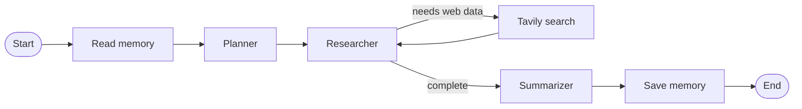

<div align="center">

# AI Researcher


**A terminal-based research assistant that remembers previous questions, researches the web, and writes a focused answer.**

[Features](#features) · [Getting started](#getting-started) · [How it works](#how-it-works) · [Project structure](#project-structure)

</div>

AI Researcher is a small Python application built with [LangGraph](https://langchain-ai.github.io/langgraph/) and [LangChain](https://python.langchain.com/). Ask a question in the terminal and the application reads the previous question from MongoDB, breaks the new question into research tasks, investigates those tasks with Tavily web search, summarizes the findings with OpenAI, and stores the current question for future runs.

> [!NOTE]
> This is a focused learning project and currently runs as an interactive command-line program. MongoDB is used for persistent memory, while LangGraph uses an in-memory checkpointer for the active thread.

## Features

- **Question planning**: turns one user question into independent factual sub-questions.
- **Persistent memory**: reads the previous question from MongoDB before planning and saves the current question after summarization.
- **Web research**: gives the researcher access to Tavily Search with up to eight recent general web results per search.
- **Tool-aware workflow**: loops between the researcher and search tool until the model has enough source material.
- **Clear synthesis**: produces a final answer that keeps the original question in view.
- **Workflow visualization**: includes the current LangGraph architecture in `assets/architecture.png`.

## Getting started

### Prerequisites

- Python 3.13.7
- An [OpenAI API key](https://platform.openai.com/api-keys)
- A [Tavily API key](https://app.tavily.com/home)
- A MongoDB deployment and connection string

### 1. Install dependencies

Using `uv`:

```bash
uv sync
```

Or using a virtual environment and `pip`:

```bash
python -m venv .venv

# Windows PowerShell
.\.venv\Scripts\Activate.ps1

# macOS/Linux
# source .venv/bin/activate

pip install -r requirements.txt
```

### 2. Configure API keys

Copy `.env.example` to `.env` and replace the placeholder values:

```dotenv
OPENAI_API_KEY = your-openai-api-key
TAVILY_API_KEY = your-tavily-api-key
MONGODB_URI = your-mongodb-connection-string
```

`MONGODB_URI` is required because the application uses MongoDB to remember the last research question. Create a free database deployment in [MongoDB Atlas](https://www.mongodb.com/atlas), create a database user, allow your IP address in the network access settings, and copy the deployment connection string into `.env`:

```dotenv
MONGODB_URI = mongodb+srv://<username>:<password>@<cluster>.mongodb.net/?retryWrites=true&w=majority
```

Replace `<username>`, `<password>`, and `<cluster>` with your MongoDB credentials and deployment details. URL-encode special characters in the username or password when necessary. The application creates or uses the `ai-researcher` database and stores the last question in the `history` collection. Without a valid `MONGODB_URI`, `python main.py` cannot start the memory store.

The `.env` file is ignored by Git. Do not commit API keys to the repository.

### 3. Run the researcher

```bash
python main.py
```

Enter a research question when prompted:

```text
What is bugging you?
How are small language models being used at the edge?
```

The completed answer is printed under `Response:`. The application uses the `research-1` thread ID and stores the last question in the `ai-researcher.history` MongoDB collection.

## How it works

The workflow in `graph.py` is compiled as a directed LangGraph state machine and completed in `main.py` with a MongoDB store:

<div align="center">
	
</div>

The same workflow is represented below in Mermaid for accessible, text-based rendering:



1. **Read memory** loads the previous question from MongoDB into `memory_context`.
2. **Planner** uses the current and previous questions to create a list of research questions.
3. **Researcher** receives those questions and can call the `web_search` tool.
4. **Tool node** executes Tavily Search and returns its results to the researcher.
5. **Summarizer** turns the collected research into the final response.
6. **Save memory** stores the current question in MongoDB for the next run.

The active graph is checkpointed with `InMemorySaver`. Long-term question memory is provided by `MongoDBStore`, configured in `main.py` with database `ai-researcher` and collection `history`.

The models are configured in the node modules:

- `gpt-5.1` for planning and research
- `gpt-5` for summarization

Change those model names in `nodes/planner.py`, `nodes/researcher.py`, and `nodes/summarizer.py` if your account uses different models.

## Project structure

```text
.
├── main.py                  # CLI entry point and MongoDB store setup
├── graph.py                 # LangGraph definition and orchestration
├── state.py                 # Shared ResearchState schema
├── assets/
│   └── architecture.png     # Current agent architecture
├── nodes/
│   ├── get_memory.py        # Read the previous question from MongoDB
│   ├── planner.py            # Structured research-question generation
│   ├── researcher.py         # Tool-enabled web research model
│   ├── store_memory.py       # Save the current question to MongoDB
│   └── summarizer.py         # Final answer generation
├── tools/
│   └── search.py             # Tavily web-search tool
├── .env.example              # Required environment-variable template
├── pyproject.toml            # Project metadata and dependencies
└── requirements.txt          # pip dependency list
```

## Troubleshooting

### API key errors

Confirm that `.env` exists at the project root and contains valid `OPENAI_API_KEY` and `TAVILY_API_KEY` values. Restart the command after changing the file.

### Dependency or Python-version errors

Use Python 3.13.7, activate the project virtual environment, and reinstall the dependencies. With `uv`, `uv sync` uses the versions recorded in `uv.lock`.

### Inspecting the workflow

Open `assets/architecture.png` to see the current agent architecture. The image is a checked-in reference diagram; update it separately if the graph edges change.

## Resources

- [LangGraph documentation](https://langchain-ai.github.io/langgraph/)
- [LangChain Python documentation](https://python.langchain.com/docs/introduction/)
- [Tavily documentation](https://docs.tavily.com/)
- [OpenAI API documentation](https://platform.openai.com/docs/)
