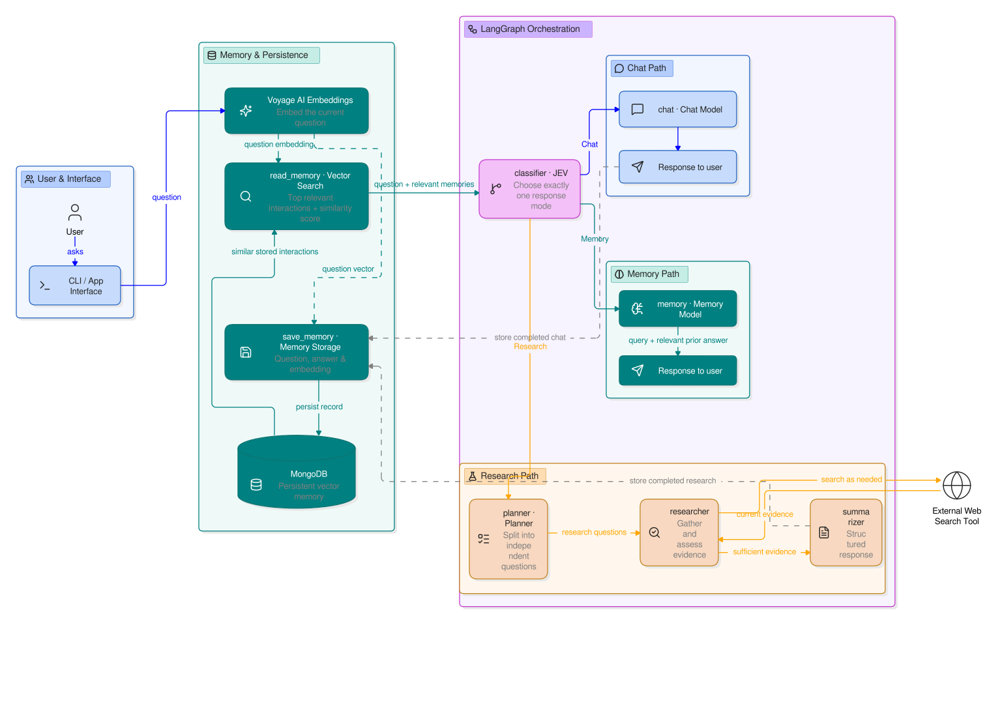
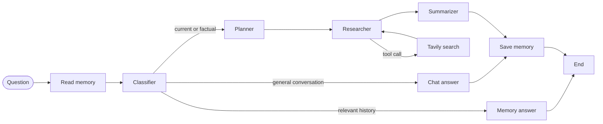

<div align="center">

# Socrates


**A terminal research assistant that chooses between memory, conversation, and web research.**

[Features](#features) · [Getting started](#getting-started) · [How it works](#how-it-works) · [Project structure](#project-structure)

</div>

Socrates is a Python command-line assistant built with [LangGraph](https://langchain-ai.github.io/langgraph/) and [LangChain](https://python.langchain.com/). It can answer casual questions, reuse relevant previous answers, or research current information on the web before producing a structured response.

> [!NOTE]
> Socrates is a local CLI application. It requires API access to a supported model provider, Tavily, Voyage AI, TypeSafe, and MongoDB. The application does not include a web UI or hosted deployment configuration.

## Features

- **Intent routing**: a TypeSafe classifier chooses the memory, chat, or research path.
- **Semantic memory**: stores questions and answers in MongoDB with Voyage AI embeddings, then retrieves relevant history with MongoDB Atlas Vector Search.
- **Web research**: decomposes research questions, searches Tavily for recent results, and loops through tool calls when more evidence is needed.
- **Multiple model providers**: supports OpenAI, Google Gemini, and Groq through a common model factory.
- **Terminal experience**: provides an interactive prompt, markdown-rendered answers, progress states, and `/help` and `/exit` commands.

## Getting started

### Prerequisites

- Python `3.13.7` or newer
- A MongoDB deployment with Atlas Vector Search enabled
- API keys for the selected model provider, Voyage AI, TypeSafe, and Tavily
- [`uv`](https://docs.astral.sh/uv/) or `pip`

### 1. Install dependencies

Using `uv`:

```bash
uv sync
```

Or using a virtual environment and `pip`:

```bash
python -m venv .venv

# Windows PowerShell
.\.venv\Scripts\Activate.ps1

# macOS/Linux
# source .venv/bin/activate

pip install -r requirements.txt
```

### 2. Configure the environment

Copy `.env.example` to `.env` and fill in the values for one model provider:

```bash
# Windows PowerShell
Copy-Item .env.example .env

# macOS/Linux
# cp .env.example .env
```

At minimum, configure the following variables:

| Variable | Purpose |
| --- | --- |
| `MODEL_PROVIDER` | Provider to use: `openai`, `gemini`, or `groq` |
| `*_API_KEY` | API key for the selected model provider |
| `*_MODEL` | Larger model used for planning and research |
| `*_SMALLER_MODEL` | Smaller model used for chat, memory answers, and summarization |
| `TYPESAFE_API_KEY` | Classifier used to route each question |
| `VOYAGE_API_KEY` | Embeddings used for semantic memory |
| `TAVILY_API_KEY` | Web search used by the research route |
| `MONGODB_URI` | MongoDB connection string |

For example, an OpenAI configuration looks like this:

```dotenv
MODEL_PROVIDER=openai
OPENAI_API_KEY=your-openai-api-key
OPENAI_MODEL=your-openai-model-name
OPENAI_SMALLER_MODEL=your-openai-smaller-model-name

TYPESAFE_API_KEY=your-typesafe-api-key
VOYAGE_API_KEY=your-voyage-api-key
TAVILY_API_KEY=your-tavily-api-key
MONGODB_URI=mongodb+srv://<username>:<password>@<cluster>.mongodb.net/?retryWrites=true&w=majority
```

Gemini and Groq use the equivalent `GEMINI_*` and `GROQ_*` variables shown in `.env.example`.

> [!IMPORTANT]
> The memory implementation uses the `socrates` database and `history` collection. Create an Atlas Vector Search index named `vector_index` on `value.embedding` before using semantic memory. Keep `.env` private; it is ignored by Git.

### 3. Run Socrates

```bash
python cli.py
```

Ask a question at the `›` prompt. Use `/help` to list commands and `/exit` or `/quit` to leave the application.

The graph runner is also available as `run_research` in `main.py` for use from another Python module:

```python
from main import run_research

for update in run_research("What changed in Python recently?"):
    print(update)
```

## How it works

The workflow is compiled from `graph.py` and streams node updates while the CLI displays progress:

<div align="center">
  
</div>


```mermaid
flowchart LR
    A([Question]) --> B[Read memory]
    B --> C[Classifier]
    C -->|relevant history| D[Memory answer]
    C -->|general conversation| E[Chat answer]
    C -->|current or factual| F[Planner]
    F --> G[Researcher]
    G -->|tool call| H[Tavily search]
    H --> G
    G --> I[Summarizer]
    D --> J[End]
    E --> K[Save memory]
    I --> K
    K --> J
```

1. **Read memory** embeds the question with Voyage AI and retrieves sufficiently similar records from MongoDB Atlas Vector Search. Recall-oriented questions can fall back to recent history.
2. **Classifier** uses TypeSafe to select `memory`, `chat`, or `research`.
3. **Memory** and **chat** answer directly with the smaller configured model.
4. **Planner** turns research requests into independent sub-questions using the larger configured model.
5. **Researcher** can call the Tavily tool. Searches use the general topic, the last week as the time range, and up to five results.
6. **Summarizer** turns the collected research into the final response.
7. **Save memory** stores the question, answer, and Voyage embedding in MongoDB for later retrieval.

The active LangGraph thread uses an in-memory checkpointer with the fixed ID `research-1`. Long-term memory is persisted in MongoDB.

## Project structure

```text
.
├── cli.py                         # Interactive terminal interface
├── main.py                        # Graph runner and MongoDB store setup
├── graph.py                       # LangGraph state machine and routing
├── state.py                       # Shared ResearchState schema
├── models/
│   ├── jev.py                     # TypeSafe routing classifier
│   └── provider.py                # OpenAI, Gemini, and Groq model factory
├── nodes/
│   ├── chat/basic_chat.py         # General conversation response
│   ├── memory/                    # Read, answer from, and save memory
│   └── research/                  # Planning, web research, and summarization
├── tools/search.py                # Tavily web-search tool
├── assets/architecture.svg        # Workflow diagram
├── .env.example                   # Environment-variable template
├── pyproject.toml                 # Project metadata and uv dependencies
└── requirements.txt               # pip dependency list
```

## Troubleshooting

### Missing environment variables

Make sure `.env` is in the project root and that `MODEL_PROVIDER` exactly matches one of `openai`, `gemini`, or `groq`. The selected provider must have both its main and smaller model variables set.

### MongoDB memory errors

Confirm that `MONGODB_URI` is valid, the deployment allows your IP address, and the `vector_index` Atlas Search index targets `value.embedding`. MongoDB credentials with special characters may need URL encoding.

### Search errors

Confirm that `TAVILY_API_KEY` is present. The Tavily tool is only used for questions routed to research.

## Resources

- [LangGraph documentation](https://langchain-ai.github.io/langgraph/)
- [LangChain documentation](https://python.langchain.com/docs/introduction/)
- [MongoDB Atlas Vector Search](https://www.mongodb.com/docs/atlas/atlas-search/vector-search/)
- [Tavily documentation](https://docs.tavily.com/)
- [Voyage AI documentation](https://docs.voyageai.com/)
- [TypeSafe on PyPI](https://pypi.org/project/langchain-typesafe/)
